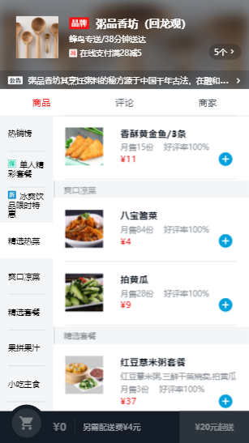

## 基于Vue.js + ES6语法开发的订餐平台

>使用Vue.js+ES6语法，基于数据驱动，自动追踪依赖的模板表达式和计算属性。使用experss+data在本地mock数据，vue-resource插件与后端进行数据交互（现已采用axios技术）。移动端采用flex弹性布局，及better-scroll解决移动端页面高度和宽度超出视口的滚动条问题，增强用户体验。全程采用组件化、模块化的开发方式，减少代码量，提高开发效率。